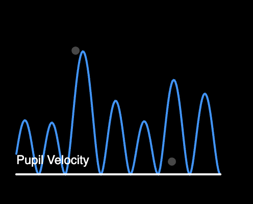
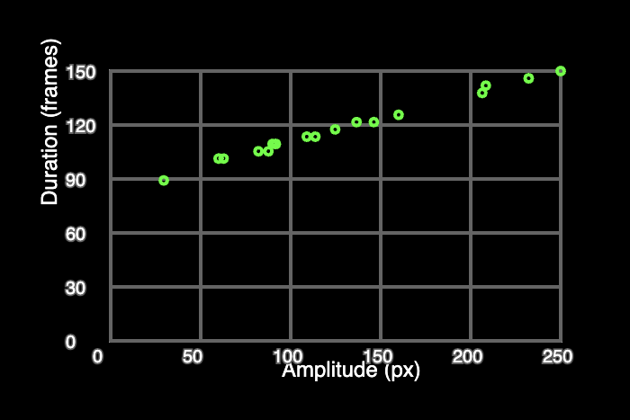
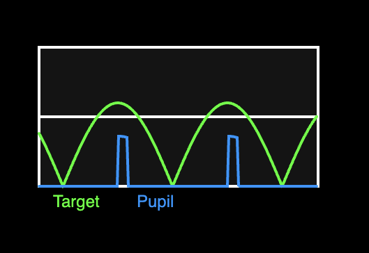

# Eye Movement Simulation

This visualization demonstrates two major types of human eye movements:

* **Smooth Pursuit**: where the eyes smoothly track a moving target.

* **Saccades**: rapid, jerky movements the eye makes to shift focus between points.

Built with p5.js. 

## View Online:
You can view the simulation here:
https://niharika-mohapatra.github.io/Eye-Movement-Simulator/

## Why do eye movements matter?
Our eyes are constantly moving even when we think we're staring at something still. These movements are crucial for gathering visual information and for how we perceive the world.

Saccades are rapid, ballistic jumps the eye makes when shifting focus from one object to another. Fixations occur when the eye focuses on a target where visual information is actually gathered. These two movements help the eye gather integrated visual information needed for scanning an environment or reading. This is the most common form of eye movement for humans

In contrast, we have smooth pursuit in which the eye moves smoothly and uniformly. This is used to track moving objects (in fact smooth pursuit cannot be performed without a moving target).

Understanding these movements helps in fields like vision science, cognitive neuroscience, and clinical diagnosis (e.g., tracking disorders, concussions, or neurological diseases).

## How does this project simulate real eye movements?

### Saccadic model:

This simulation models rapid eye jumps (saccades) as the eyes shift focus from one point to another.

The red dot represents a shifting point of interest, jumping randomly after short fixations, which are represented by grey dots on the screen.

The pupils move toward the target using a biologically inspired minimum jerk profile—smooth acceleration and deceleration mimicking natural saccadic motion.

### What does the graph reveal?
Green Line (Pupil Velocity):
Sharp, burst-like peaks that represent the rapid flicks of saccadic eye movement. Each spike reflects a saccade—quick, ballistic movements with high peak velocity and a fixed duration-amplitude relationship.

Longer jumps require faster, longer saccades. Shorter jumps produce quicker, briefer flicks. 

Unlike smooth pursuit, the eyes do not track continuous motion. They jump between fixations, emphasizing speed and efficiency over continuous accuracy.

### Smooth Pursuit model:
This simulation models basic eye behavior using vector math and physics-inspired logic. 

The red dot moves with a smooth, sine-wave trajectory.

### What does the graph reveal?

These approximations allow users to intuitively understand how our visual system balances precision, delay, and effort when tracking moving objects.

* Green Line (Target Velocity): A continuous sine wave, representing the consistent motion of the stimulus.

* Blue Line (Pupil Velocity): Step-like changes in velocity that occur only when the system deems pursuit necessary.

This stepped profile captures the all-or-nothing nature of biological smooth pursuit. The eyes don’t constantly follow, they wait until the target moves too far or fast, then quickly catch up. 

## Features:
Visual simulation of eye tracking behavior.

Custom-coded models for:

* Smooth pursuit using velocity-based motion and pursuit gain.
* Saccades using biologically inspired velocity profiles (minimum jerk).

Visual graphs:

* Velocity over time
* Amplitude vs. duration of saccades. 

Tech Stack:
* p5.js
* HTML5 Canvas
* Javascript

## Background:
This project was created to visualize oculomotor behavior as part of a cognitive science project. The models are simplified but grounded in the neurophysiology of eye movement.
