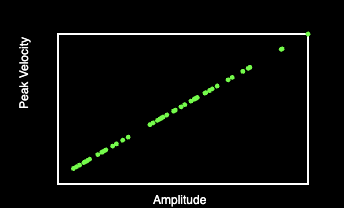
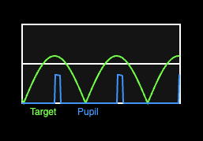

# Oculomotor Dynamics: Eye Movement Simulation

An interactive computational neuroscience visualization demonstrating the biomechanical and control loop differences between the two primary classes of human eye movements: **Saccades** and **Smooth Pursuit**. 

Built natively in JavaScript using the **p5.js** library.

## View Online
View the live simulation here: [https://niharika-mohapatra.github.io/Eye-Movement-Simulator/](https://niharika-mohapatra.github.io/Eye-Movement-Simulator/)

---

## Computational Models

### 1. Saccadic Model (`saccade.js`)
Saccades are rapid, ballistic eye movements used to abruptly shift the fovea between discrete fixation points. This project simulates eye jumps using a biologically grounded **Pulse-Step neural command driving a second-order mechanical system (Mass-Spring-Damper)**.

* **The Physics Engine**: The mechanical plant of the eye is governed by the differential equation:
    $$\alpha = \frac{T - B\omega - K\theta}{J}$$

  Where:
    * $J = 1.0$ (Orbital Inertia)
    * $B = 6.0$ (Viscous Damping/Friction)
    * $K = 25.0$ (Elastic Stiffness of Extraocular Muscles)
* **The Pulse-Step Burst**: To initiate a rapid movement, we apply a high-torque "pulse" command ($T = 20 + 0.4 \times \text{Amplitude}$) for a fixed duration ($8\text{ frames}$) to aggressively overcome viscous damping ($B$). Once completed, it drops to a steady "step" torque ($T = 15$) to balance elastic forces ($K$) and maintain the eye's updated fixation position.
* **The Main Sequence Plot**: The interface renders a live **Main Sequence Scatter Plot (Amplitude vs. Peak Velocity)**. As the simulation runs, it dynamically logs the mechanical state metrics, verifying that larger angular displacements mathematically dictate higher peak velocities. This accurately captures vertebrate oculomotor constraints.

### 2. Smooth Pursuit Model (`smooth_mvt.js`)
Smooth pursuit allows the visual system to steadily track a continuously moving object in space. This simulation models the tracking loop using vector kinematics and an error threshold gate.

* The visual stimulus (red target) oscillates smoothly:
  $x = \text{width}/2 + 300 \sin(t)$.
* The model evaluates tracking conditions using a localized spatial error check. The pupil remains locked until the target vector escapes a specified positional threshold:
    $$\text{distanceToTarget} > \text{deadZoneRadius } (80\text{px})$$
* When tracking activates, the pupil velocity vector scales matching current target deltas via **Pursuit Gain multiplier of 0.6**. 
* The continuous time-series line graph displays the Target Velocity profile in **Green** and the matching Pupil Velocity profile in **Blue**. The tracking constraints create a distinct "stepped" velocity profile, demonstrating how biological systems balance sensory processing delays, threshold barriers, and physical tracking efforts.

---

## Tech Stack
* **Engine**: p5.js (HTML5 Canvas rendering context)
* **Language**: JavaScript (ES6+ Architecture)
* **Hosting**: GitHub Pages

---

## Background & Significance
This simulator was developed to bridge the gap between abstract mathematical tracking models and real neurophysiological control structures. By modulating physical traits like damping coefficients or feedback gains, the project serves as an introductory tool for vision science, cognitive neuroscience modeling, and understanding clinical oculomotor pathologies (such as tracking degradation in neurodegenerative conditions or concussions).
